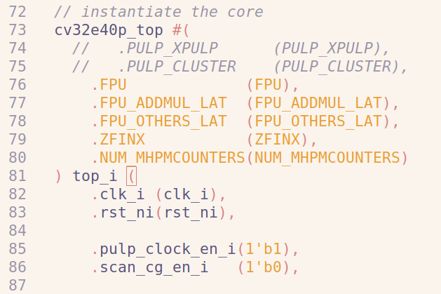

# keran-cv32-记录

## 2024-10-16

路径：/home/like/3-keran-CV32/keran-cv32e40p/

仿真平台：单cpu平台

修改内容：

1. 修改/home/like/3-keran-CV32/keran-cv32e40p/example_tb/core/Makefile中的vlog/vlib/vopt/vsim版本

   

2. 修改/home/like/3-keran-CV32/keran-cv32e40p/example_tb/core/cv32e40p_tb_subsystem.sv：

   注释了PULP_XPULP/PULP_CLUSTER两行，因为cv32e40p_top模块没有这两个参数。

